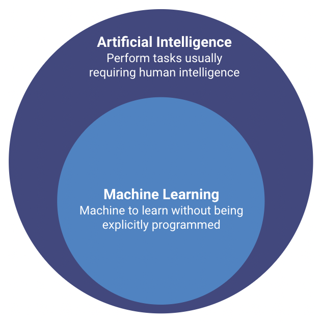
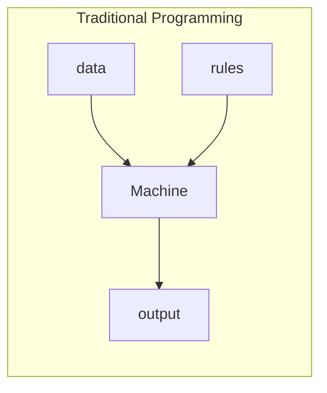
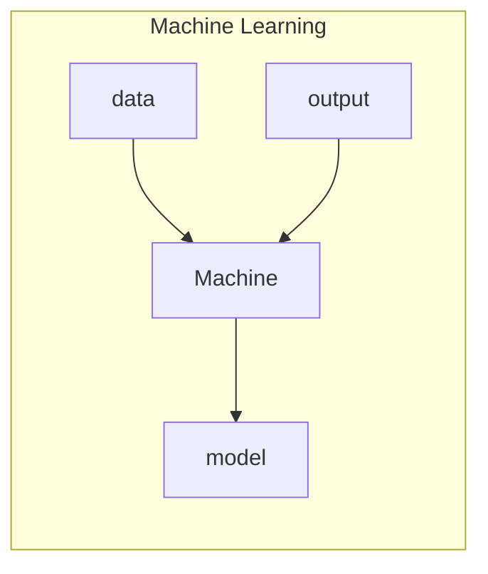
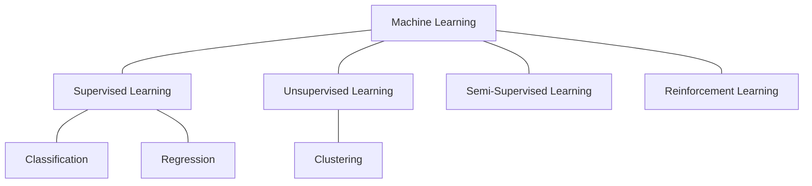
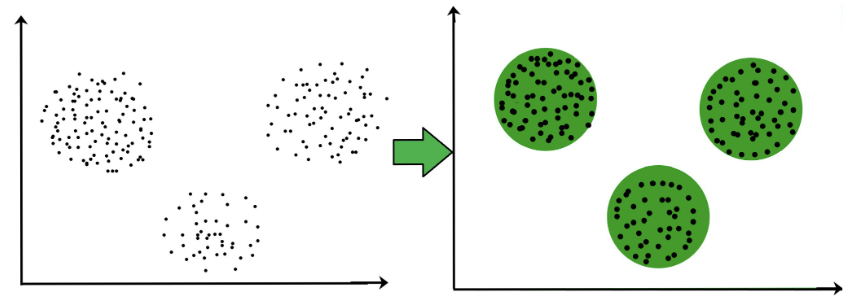
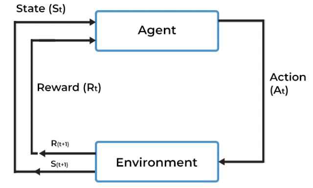
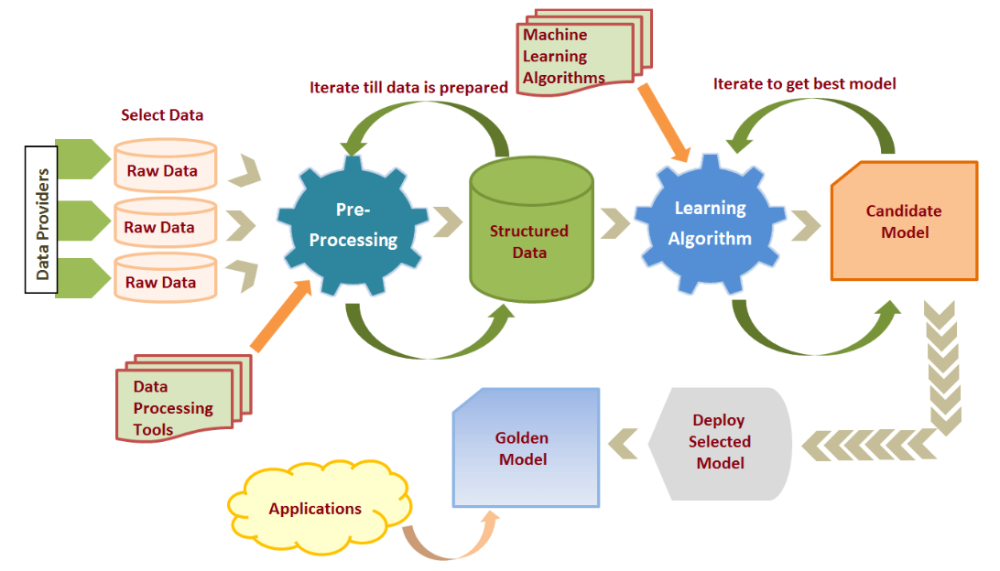

# Introduction

## What is it?

-   Subfield of Artificial Intelligence

-   Systems to automatically learn and improve from experience, without being
    explicitly programmed

-   Algorithms (models) that can interpret and learn from complex data,
    identify patterns, and make predictions or decisions based on it

-   Usage: disease identification, financial projections, image recognition,
    speech recognition, natural language processing, fraud detection, etc.

<figure markdown>
  { width="400" }
  <figcaption>Machine Learning Subfield</figcaption>
</figure>

## Types of Machine Learning

There are several machine learning algorithms that enables to build complex models.
These algorithms can be grouped into a certain category depending on its learning process.

-   Supervised Learning: uses labeled data (expected output already known) to train the models.
    The learning process finds the best way to map the inputs to the respective outputs.

-   Unsupervised Learning: uses unlabeled data (doesn't include an output variable) to train the models.
    The model discovers patterns and features in the input data.

-   Semi-Supervised Learning: mix between supervised and unsupervised learning.
    Only some of the ouput is known.

-   Reinforcement Learning: follows trial and error to get the desired result.
    Trains the machine to take the most suitable action at a given moment, and it learns from
    the rewards.

Within the same machine learning, we can also categorize the different problems,
depending on what the machine learning algorithm is trying to predict.

-   Classification: assign class labels to inputs (Ex: classify emails as spam or "not spam")
-   Regression: assign numeric value to inputs (Ex: product price prediction)
-   Clustering: divide input data into clusters (Ex: group together users with same patterns)

<figure markdown>
  { width="500" }
    <figcaption>
        Classification and Regression. Adapted from "Regression vs Classification in Machine Learning". 
        Retrieved from [here](https://www.javatpoint.com/regression-vs-classification-in-machine-learning).
    </figcaption>
</figure>

<figure markdown>
  { width="500" }
    <figcaption>
        Clustering. Adapted from "Clustering in Machine Learning" by Surya Priy. 
        Retrieved from [here](https://www.geeksforgeeks.org/clustering-in-machine-learning/).
    </figcaption>
</figure>

<figure markdown>
  { width="400" }
    <figcaption>
        Reinforcement. Adapted from "Reinforcement Learning 101" by Shweta Bhatt. 
        Retrieved from [here](https://towardsdatascience.com/reinforcement-learning-101-e24b50e1d292).
    </figcaption>
</figure>

## Lifecycle

The Machine Learning lifecycle involves several steps. This is not characterized by
being a linear process since it is common to jump to previous steps in the process,
based on conclusions drawn in future phases. The major steps are the following:

1. Gathering data - identify the different data sources, data collection, data integration

2. Data pre-processing - cleaning and converting raw data into a useable format
   (Ex: missing values, duplicate records, invalid data, noise)

3. Data Analysis - study the relationships contained in the different variables,
   with vision in which could be a suitable model

4. Model Selection - train and evaluate several machine learning algorithms/pipelines

5. Test Model - final evaluation of the candidate model in a different dataset

6. Deployment - deploy the model in the real world system! So it can be consumed by other applications

<figure markdown>
  { width="600" }
    <figcaption>
        Machine Learning Process. Adapted from "Machine Learning Process And Scenarios" by Akhil Mittal.
        Retrieved from [here](https://elearningindustry.com/machine-learning-process-and-scenarios).
    </figcaption>
</figure>

## Families of Algorithms

Machine Learning algorithms can be classified into different families,
depending on nature of the learning process. The four major families are the following:

-   Information-based: concepts from Information Theory to train the models (Ex: Decision Trees)
-   Similarity-based: measuring similarity between past and forthcoming occurrences (Ex: K-Nearest Neighbor)
-   Probability-based: measuring how likely is that some event will occur (Ex: Bayesian Network)
-   Error-based: minimizing the total error through a set of training instances (Ex: Linear Regression)
