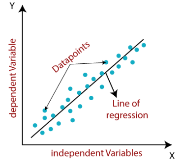
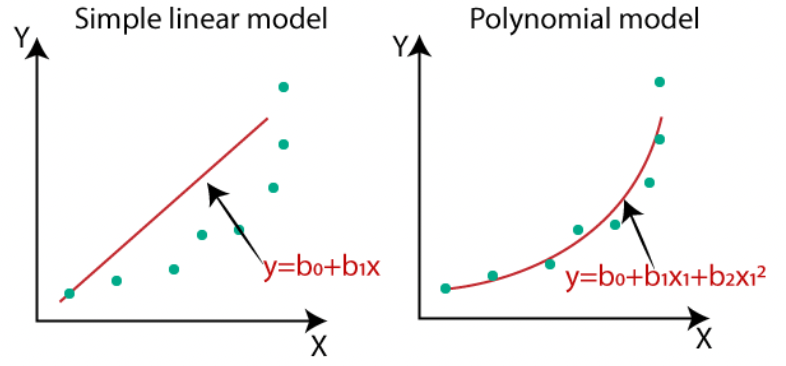

# Regression

Regression, along with classification, are the most common machine learning techniques.
The difference between them is that in regression the algorithms are used to predict
continuous outcome. Regression machine learning models live in the group of
supervised learning where the output variable (dependent variable) is known, and
numeric. The goal is to understand and model the relationship between the
dependent variable (what we want to predict), and one or more independent variables.


## Linear Regression

- Statistical method used to model the relationship between a dependent variable and
  one or more independent variables.

- Assumes that the relationship between the dependent variable and the
  independent variable(s) is linear.

<strong>Training</strong>: find the line of best fit that minimizes the sum of
squared differences between the predicted values and the actual values of the
dependent variable.

The equation of the hyperplane (n independent variables) is given by:

y = b0 + b1X1 + b2X2 + ... + bn\*Xn

In the simplest form (only one independent variable), the equation is the same
as the straight line equation.

y = b0 + b1X1

<figure markdown>
  { width="400" }
    <figcaption>
        Linear Regression Model. Adapted from "Linear Regression in Machine Learning”. 
        Retrieved from [here](https://www.javatpoint.com/linear-regression-in-machine-learning).
    </figcaption>
</figure>

Before using linear regression model, make sure that the data follow these assumptions:

1. The variables should be measured at a continuous level.

2. Relationship between the dependent variable and the independent variable(s) is linear
   (scatter plot to visualize).

3. The observations and variables should be independent of each other.

4. Your data should have no significant outliers.

5. The residuals (errors) of the best-fit regression line follow normal distribution.

## Polynomial Regression

Polynomial Regression is very similar to Linear Regression. The only difference is that
it transforms the input data to include non-linear terms. It is described
by a degree, which is the highest power computed from the original input. The amount
of additional terms will consequently depend on the degree.

A dataset with a single feature X

```
X = [
    [X1],
    [X2],
    [X3],
]
```

using a polynomial of second degree would be transformed to:

```
X = [
    [X1, X1²],
    [X2, X2²],
    [X3, X3²],
]
```

<figure markdown>
  { width="500" }
    <figcaption>
        Linear vs Polynomial Regression. Adapted from "Why -Polynomial Regression and not Linear Regression?” by Tamil Selvi. 
        Retrieved from [here](https://www.numpyninja.com/post/why-polynomial-regression-and-not-linear-regression).
    </figcaption>
</figure>

The training process would be exactly the same: find the coefficients
for each of the features that minimizes the square error. In the described example,
since we would have 2 coefficients instead of 1, it would define a parable instead of
a straight line.

Key factors to consider:

- Include nonlinear terms such as 𝑥².
- Often used when the relationship between the variables cannot be accurately described by a linear model.
- Plot the data (Ex: scatter plot) and check if a linear model is appropriate.
