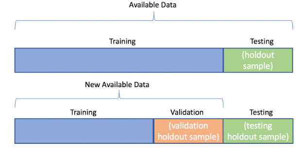
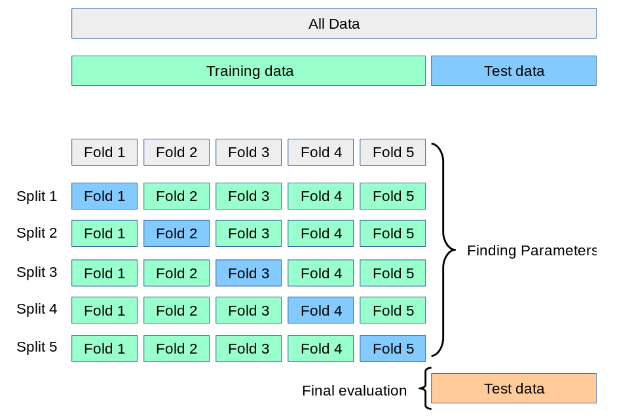

# Model Evaluation

Before deploying a model to be consumed by several applications,
we need to know what is the expected performance that it will achieve.
After training a model using the collected and transformed dataset,
concrete metrics have to be calculated so we can have a vision of
how well the algorithm can model the data that we have on hand.

Depending on the type of the problem (supervised, unsupervised,
classification, regression), there are different metrics
to evaluate. In supervised learning, we have available target values
that we can use to compare to what was predicted by the model.
However, the metrics are different between classification and regression problems
since in the first one the target variable is not continuous.

Another topic is worth mentioning, and that can lead to misleading
conclusions is what data should be used to evaluate. If we train
the model with the entire dataset, make predictions over the same dataset,
and compare these predictions with the actual values, we are not
verifying how the model behaves with unseen data samples. That's why
before speaking about evaluation metrics, we have to jump into
data split strategies, to be able to separate the data into
different sets depending on their use.

## Data Split Strategies

A data split strategy is a way of splitting the data
into different subsets, so each subset is used with a different goal.
This will prevent us from using the entire dataset for training, tuning
, and evaluating which can give false conclusions.

The most used strategies are:

- train-test split
- cross-validation
- leave one out

The idea behind the train-test split, as the name suggests, is to split
the entire dataset in different sets, usually the following:

- training set (usually ~70%): data samples used to train the model
- validation set (usually ~15%): data samples used to tune the model
  (hyperparameters, architecture)
- testing set (usually ~15%): data samples used to evaluate the model

<figure markdown>
  { width="500" }
    <figcaption>
        Train-Test Split. Adapted from "Train/Test Split and Cross Validation – A Python Tutorial” by Greg Bland. 
        Retrieved from [here](https://algotrading101.com/learn/train-test-split/).
    </figcaption>
</figure>

Cross-validation, and leave one out are strategies used usually when
the dataset size is not huge, since they are computationally expensive.
The idea is to divide the entire dataset into K folds. The model
will be trained using N - 1 folds and evaluated on the remaining fold.
These will be performed K (number of folds) times, so the advantage is that
the data coverage will be higher (more reliable evaluation).

<figure markdown>
  { width="500" }
    <figcaption>
        Cross Validation. Adapted from "Cross-validation: evaluating estimator performance”. 
        Retrieved from [here](https://scikit-learn.org/stable/modules/cross_validation.html).
    </figcaption>
</figure>

Leave one out is usually applied on small datasets. It is a particular case
of cross-validation, it is equivalent to using cross-validation with
N folds, given that N is the number of samples in the dataset.
This means that the model will be trained and evaluated N times,
and the prediction for evaluation will be performed on a single
sample at a time.

It is worth mentioning two additional topics:

- temporal data: when dealing with temporal data, it is
  important to sort before applying the split, because
  it is considered "cheating" if the sort operation
  is not applied. Imagine having past and future samples
  in the training set of a sample in the test set. This
  would not reflect the real usage of the model;

- stratification: in classification problems, it is important
  to maintain the class distribution along the different sets,
  so we can avoid having, for example, a test set with samples
  of a single class.

## Evaluation Metrics

Evaluation metrics can be divided into regression and classification
since the output is different depending on the type of the problem.
However, the goal of these metrics is to evaluate how well the model
can make predictions. It receives as input the actuals (y) and
the predicted values for the same samples (ŷ).

### Regression

In regression, the actuals and the predicted values are continuous.
The following metrics are usually used to evaluate this kind of models:

- Mean Absolute Error (MAE)

MAE is the easiest metric to interpret. It represents how much
the predicted value deviates from the actual value. n is the number
of samples (size of y and ŷ).

`MAE = (1/n) * Σ|yi - ŷi|`

- Mean Square Error (MSE)

MSE is very similar to MAE. The difference is that it is squared instead
of using the absolute difference. This will penalize
higher errors. It is usually used as a loss function in some of the
models (i.e Neural Network).

`MSE = (1/n) * Σ(yi - ŷi)²`

- Root Mean Square Error (RMSE)

RMSE is the root of MSE. This facilitates the interpretation
since it converts the unit from squared to the original unit.

`RMSE = sqrt((1/n) * Σ(yi - ŷi)²)`

- R-Squared Score (R2)

R2 is a metric that represents how much variance of the data
was successfully modeled. It indicates how well the model
could represent the data and can establish a relationship
between the independent variables and the dependent variable.

SSres is the residual sum of squares, and SStot is the
total variance contained in the target output y. This metric is
within the range of 0.0 to 1.0, being 1.0 a perfect model, able to
represent the entire variance. It can also have negative values
in cases where there is a terrible relationship between the
target and independent variables.

`R2 = 1 - (SSres / SStot)`
