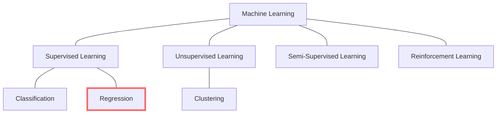

# Regression

Regression, along with classification, are the most common machine learning problems.
The difference between them is that in regression the algorithms are used to predict
continuous outcome. Regression machine learning models live in the group of
supervised learning where the output variable (dependent variable) is known, and
numeric. The goal is to understand and model the relationship between the
dependent variable (what we want to predict), and one or more independent variables.

## Linear Regression

-   statistical method used to model the relationship between a dependent variable and
    one or more independent variables

-   assumes that the relationship between the dependent variable and the
    independent variable(s) is linear

<strong>Training</strong>: find the line of best fit that minimizes the sum of
squared differences between the predicted values and the actual values of the
dependent variable

The equation of the hyperplane (n independent variables) is given by:

y = b0 + b1X1 + b2X2 + ... + bn\*Xn

In the simplest form (only one independent variable), the equation is the same
as the straight line equation.

y = b0 + b1X1

<figure markdown>
  { width="400" }
    <figcaption>
        Linear Regression Model. Adapted from "Linear Regression in Machine Learning”. 
        Retrieved from [here](https://www.javatpoint.com/linear-regression-in-machine-learning).
    </figcaption>
</figure>

Before using linear regression model, make sure that the data follow these assumptions:

1. The variables should be measured at a continuous level

2. Relationship between the dependent variable and the independent variable(s) is linear
   (scatter plot to visualize)

3. The observations and variables should be independent of each other

4. Your data should have no significant outliers

5. The residuals (errors) of the best-fit regression line follow normal distribution
